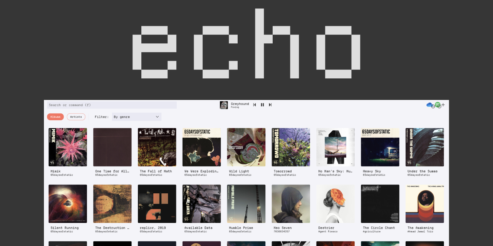

<p align="center">
  
</p>

Echo is a music app that allows you to connect to multiple sources of music and
play them directly through the app. It's album focused, meaning that instead of
treating your library as a list of songs, it treats it as a list of albums, allowing
you to shuffle albums, browse them based on genres, and more.

> [!WARNING]
> The app is currently in a very alpha-ish state, so expect things to break
> and features to be missing. Nonetheless, it's already usable for basic music
> browsing and playing.

## 🛣️ Features and roadmap

- [x] Multiple provider support & sync (currently Spotify and OneDrive, but most of the scaffolding is in place for more)
- [x] Album browser
- [x] Artist browser
- [x] Album details
- [x] Genre fetching and browsing
- [x] Scrobbling support (upcoming via WebScrobbler, see [PR for tracking](https://github.com/web-scrobbler/web-scrobbler/pull/4996))
- [x] Search support
- [x] Shuffling
- [ ] Queue management
- [ ] More providers (YouTube Music, Google Drive, etc.)
- [ ] Keyboard-driven navigation

## 🔧 Local setup

Echo is built using [TypeScript](https://typescriptlang.org), [Lit](https://lit.dev) and [Effect](https://effect.website) as the
backbone of most of the app logic. To get started, clone the repository and install
the dependencies:

```sh
yarn install
```

In order to connect to certain backends that the app supports, you'll need to
run the local server via HTTPS instead of HTTP to avoid CORS issues. To do this,
make sure you have [mkcert](https://github.com/FiloSottile/mkcert) installed and
then run:

```sh
mkcert -install
yarn setup
```

Once you've done this, make sure you have a `.env.local` file on the web package that
contains the configuration for the backends you want to connect to. A full example
of this file would be:

```
VITE_ECHO_BASE_URL=https://localhost:443
VITE_GRAPH_CLIENT_ID=your client ID
VITE_GRAPH_REDIRECT_URI=http://localhost:443
VITE_GRAPH_SCOPES=user.read,files.read,files.read.all
VITE_SPOTIFY_CLIENT_ID=your client ID
VITE_SPOTIFY_SECRET=your secret
```

Finally, once all this is done, you can run the app with:

```sh
yarn dev
```
